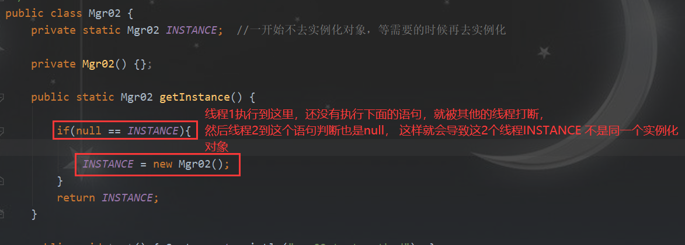
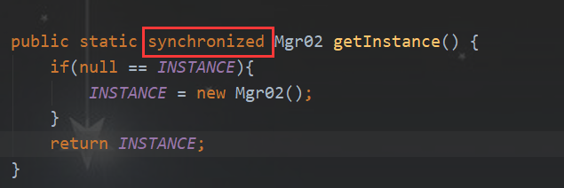
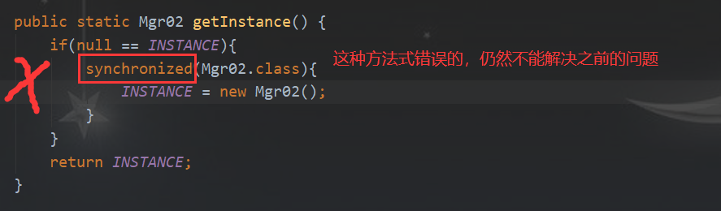
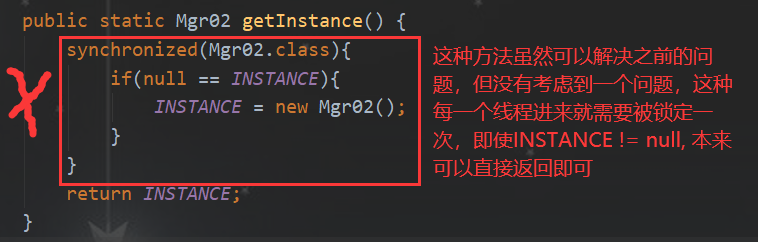
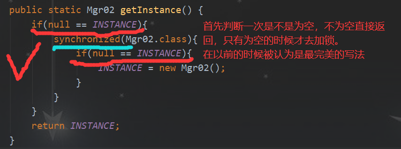

# 单例设计模式
## 方式一：饿汉式
类加载到内存后，就实例化一个单例，JVM保证线程安全
```
/**
 * 单例设计模式
 * 类型一：饿汉式
 * 类加载到内存后，就实例化一个对象，JVM保证线程安全（因为局部变量加载的时候就实例化对象）
 * 简单实用，推荐使用
 * 唯一缺点：不管用到与否，类加载时就完成实例化，但如果不用的话那为什么要实例化泥？
 */

public class Mgr01 {
    private static final Mgr01 INSTANCE = new Mgr01();

    private Mgr01(){};  //私有化构造方法

    public static Mgr01 getInstance(){ return INSTANCE; }

    public void test() { System.out.println("mgr01 test method"); }

    public static void main(String[] args) {
        Mgr01 m1 = Mgr01.getInstance();
        Mgr01 m2 = Mgr01.getInstance();
        System.out.println(m1 == m2);
    }
}
```
## 方式二：懒汉式
```
/**
 * 单例设计模式
 * 类型二：懒汉式
 * 虽然实现了按需要的时候才去初始化，但却带来了多线程访问的时候可能存在问题
 */
public class Mgr02 {
    private static volatile Mgr02 INSTANCE;   
    //一开始不去实例化对象，等需要的时候再去实例化

    private Mgr02() {};

    public static Mgr02 getInstance() {
        if(null == INSTANCE){
            INSTANCE = new Mgr02();
        }
        return INSTANCE;
    }

    public void test() { System.out.println("mgr02 test method"); }

    public static void main(String[] args) {
        Mgr02 m1 = Mgr02.getInstance();
        Mgr02 m2 = Mgr02.getInstance();
        System.out.println(m1 == m2);
    }
}
```
【分析】虽然这种方式，不会在类一开始类加载的时候就实例化对象，修复了之前饿汉式无伤大雅的一个问题，只需要在我们需要的时候进行实例化对象，但存在一个严重的问题：在多线程访问的时候：  
  

> 如果想要解决上面的多线程的问题，可以选择加一个`synchronized`,给`getInstance()`方法上加锁，虽然这样肯定可以解决上面的问题，但同时也是会带来一定的效率的下降：  

  

> 进一步的演化，发现上面如果锁在方法上的话，就会影响效率 ，能不能再缩小锁的范围，于是就有了以下的几种：  

  

  

  

## 方式三：静态内部类
```
/**
 * 静态内部类的方式
 * JVM保证单例
 * 加载内部类的时候不会去加载内部类，这样解决了第一种饿汉式的问题，同时保证单例
 */
public class Mgr03 {
    private Mgr03() {};
    
    //当外面Mgr03类加载的时候，内部类不会被实例化
    private static class Mgr03Holder {
        private final static Mgr03 INSTANCE = new Mgr03();
    }
    
    public static Mgr03 getInstance(){
        return Mgr03Holder.INSTANCE;
    }

    public void test() { System.out.println("mgr03 test method"); }

    public static void main(String[] args) {
        Mgr03 m1 = Mgr03.getInstance();
        Mgr03 m2 = Mgr03.getInstance();
        System.out.println(m1 == m2);
    }
}
```

## 方式四：枚举实现单例
> `effective java`提到的单例的方式

```
/**
 * 不仅可以解决线程同步，而且还可以防止反序列化
 * 什么叫防止反序列化？
 * 在之前的写法中，虽然我们把构造方式进行了私有化，但是在Java中，我们依然可以利用反射的方式创建出对象
 * 但枚举类式没有构造方法，就算通过其他的方式拿到class文件，依然不能构造出对象
 */
public enum Mgr04 {
    INSTANCE;

    public void test() { System.out.println("gr04 test method"); }

    public static void main(String[] args) {
        Mgr04 m1 = Mgr04.INSTANCE;
        Mgr04 m2 = Mgr04.INSTANCE;
        System.out.println(m1 == m2);
    }
}
```
【分析】虽然这种是最完美的，但实际上本来我们要定义一个对象，但最后定义成一个枚举类型  

【总结】推荐使用第一种方式，但实际的项目中，一般很少自己来写单例，一般交给spring来帮我们管理单例。  