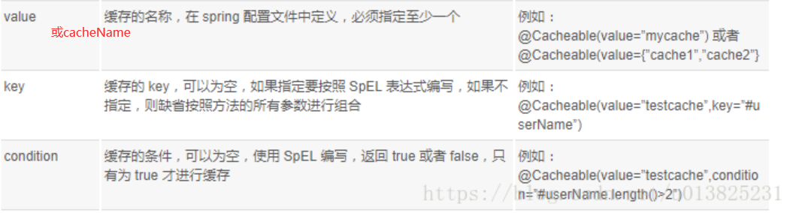

# redis
## redis服务安装，启动，关闭
```
$ wget http://download.redis.io/releases/redis-6.0.6.tar.gz
// 使用wget来下载
$ tar xzf redis-6.0.6.tar.gz
$ cd redis-6.0.6
$ make
// 执行make的时候，可能会报错，如果机器上没有安装gcc的环境，就会提示cc编译异常  
// 可能make的命令没找到， 可以apt-get install make
// 可以执行 apt-get install gcc 安装好gcc的环境

make编译成功以后，为了以后每次不用进入src再去执行命令的话，我们可以先执行make install 
发现执行make install命令后，会将一些可执行的命令加入到 /usr/loacl/bin目录下
```
>  启动redis命令

```
redis-server
// 查看端口号
ps -ef|grep redis
// 发现会占用 6379 端口
// 也可以在启动redis服务的时候，指定配置文件在目录下的redis.conf
// redis-server redis.conf 
```

> 关闭redis服务器端服务

```
1. 通过 kill -9 [pID]
// 先查看port: ps -ef|grep redis
2. 通过redis-cli的命令来关闭： redis-cli shutdown
```

## 使用redis服务
> `redis`的客户端：用来连接`redis`的服务，向`redis`的服务发送命令，并且显示`redis`服务处理结果  
> `redis-clis`是`redis`自带的客户端的程序，所以可以直接使用`redis-cli`启动`redis`的服务  

```
直接使用redis-cli: 默认连接127.0.0.1(本机)的6379端口上的redis的服务  
redis-cli -p 端口号：可以指定连接本机127.0.0.1的指定端口上的redis服务  
redis-cli -h ip地址 -p 端口号：可以指定指定ip主机上的指定端口号上的redis服务  
```

## 关闭redis客户端
```
exit或者quit
```
## redis的基本知识
### 测试redis的性能
```
redis-benchmark

====== PING_INLINE ======
  100000 requests completed in 1.86 seconds
  50 parallel clients
  3 bytes payload
  keep alive: 1
  host configuration "save": 3600 1 300 100 60 10000
  host configuration "appendonly": no
  multi-thread: no

// 表示在1.86s内完成了10w条请求
```
### ping命令
> `redis`的沟通命令，查看状态

```
127.0.0.1:6379> ping
PONG
// 若服务器端返回PONG，表示redis的服务正常
```
### info命令
> 查看redis服务器的统计信息

```
127.0.0.1:6379> info
# Server
redis_version:6.0.6
redis_git_sha1:00000000
redis_git_dirty:0
redis_build_id:95956049f4448712
 ...
```

### select切换数据库实例
> `redis`默认有16个数据库实例，作用类似于`MySQL`的数据库实例，区别在于`MySQL`可以自己创建实例，但`redis`不能自己去创建实例，只能使用`redis`自己创建的数据库实例,开发人员不能修改和创建实例，并且给这些数据库实例进行编号，这些编号从0开始，一直到15,所以在使用的时候，需要时候编号来操作数据库实例    

> 但也可以通过配置文件的方式来自己配置数据库实例的数量，`redis`的每一个数据库实例 本身占用的储存空间很少，所以不需要考虑`redis`的数据库实例太多造成储存空间浪费的问题    

> 默认在登录的时候连接的是编号是0的数据库实例  
> 可以使用` select 数据库编号 `来进行切换数据库实例

```
127.0.0.1:6379> select 1
OK
127.0.0.1:6379[1]> 
// 发现后面会带有一个[1]的编号，默认是0号可以省略
```

### dbsize查看当前数据库中key的数量
> 返回当前数据库的key的数量

```
127.0.0.1:6379> dbsize
(integer) 1
```
### keys [匹配符] 查看当前数据库中所有的key值
> `keys *` : * 代表匹配所有，代表查询所有的key值

### flushdb: 清空当前库实例里面所有的数据

### flushall: 清空所有数据库实例中的数据

### config get [匹配符] 查看redis的配置信息
> `config get *` : 查看`redis`的所有的配置信息

```
127.0.0.1:6379> config get port
1) "port"
2) "6379"
```

### redis对key的操作命令
#### 获取key的信息
- `keys`：查看所有符合模式的`key`

>  语法：`keys [匹配符]`  
>  作用：查看所有符合匹配符模式的key, 匹配符可以使用以下的一些通配符

```
1. *： 可以表示0个或多个字符，例如 keys * 查看所有的key
2. ?:  表示单个字符，例如 wo?d，可以匹配word,wood等 
3. []: 表示选择[]内的一个字符，例如wo[or]d,匹配word,wood,不匹配wold,woord.
```
-  `exists key [key1 key2 ...]` 判断某一个或多个key是否存在数据库实例中
```
127.0.0.1:6379> exists t
(integer) 0
127.0.0.1:6379> exists test
(integer) 1
// 返回结果为0：表示不存在
// 返回结果为1：表示存在
127.0.0.1:6379> exists test tse hh 
(integer) 1
// 判断test tse hh 这几个是否存在在数据库实例中，只要有一个存在就返回1 
```
- `type key`: 查看指定`key`的数据类型
> 因为`redis`的数据类型有5种，所以对应的`key`的类型也会有多种，因为针对不同类型的`key`有不同的操作命令，可以通过`type`命名查看`key`的类型  

```
127.0.0.1:6379> keys *
1) "test"
127.0.0.1:6379> type test
string
127.0.0.1:6379> 
```

#### 移动key
- `move key 数据库编号`：移动指定的`key`到指定的数据库实例中
```
127.0.0.1:6379> keys *
1) "k1"
2) "test"
// 1. 查看当前数据库0号库中含有 k1和test的key
127.0.0.1:6379> move k1 1
(integer) 1
127.0.0.1:6379> keys *
1) "test"
// 2. 将k1的key移动到编号为1的数据库实例中，然后再次查看编号为0的数据库实例中不存在k1的key
127.0.0.1:6379> select 1
OK
127.0.0.1:6379[1]> keys *
1) "k1"
// 3. 切换到数据库编号为1的数据库实例中，然后查看所有的key，发现存在k1的key
```

#### key生存时间操作
- `ttl`：查看指定的`key`的剩余生存时间

> `ttl`: (`time to live`)   
> `redis`是基于内存的数据库，但有的时候，我们的数据使用过一次就不希望再次的使用，这个时候我们可以考虑将这个数据从内容中移除  
> 所以我们可以设置`key`的最大生存时间  

> **返回值**  
> 若返回2：表示要查看的`key`在当前的数据库实例中不存在  
> 如返回-1：表示这个`key`没有设置生存时间，只要不关机，那么这个key就不会消失  

- `expire key seconds`: 设置`key`的最大生存时间
```
127.0.0.1:6379[1]> ttl k1
(integer) -1
// 1. 开始查看k1的最大生存时间是无穷
127.0.0.1:6379[1]> expire k1 20
(integer) 1
// 2. 通过expire来设置k1的最大生存时间为20s
127.0.0.1:6379[1]> ttl k1
(integer) 15
127.0.0.1:6379[1]> ttl k1
(integer) 6
// 3. 连续查看k1的剩余时间
127.0.0.1:6379[1]> ttl k1
(integer) -2
127.0.0.1:6379[1]> keys *
(empty array)
// 4. 当20过后，k1已经不存在在当前的数据库实例中了
```

#### 修改key的信息
- `rename key newKey`: 重名名`key`(一般不推荐修改)
```
127.0.0.1:6379> keys *
1) "test"
127.0.0.1:6379> rename test test1
OK
127.0.0.1:6379> keys *
1) "test1"
```

#### 删除key
- `del key [key1 key2 ...]`: 删除指定的一个或多个`key`

> 返回值代表实际删除的`key`的数量，若删除的`key`实际上不存在，那么就会忽略  

## redis的五种数据结构
> `redis`不仅支持简单的`key-value`类型的数据，同时还提供`list, set, zset, hash` 等数据结构的储存。  
> `redis`还支持数据的备份，即`master-slave`模式的数据备份   

### 字符串
#### 字符串概念
> 单个`key`对应单个`value`  
> 他能储存任意的数据类型，包括二进制数据，序列化的数据，JSON化的对象，甚至是一张图片，最大512M  

#### redis有关string类型的操作命令
##### 新增加string类型的数据到redis数据库中
- `set key value`: 将`string`类型的数据设置到`redis`中
```
127.0.0.1:6379> set k1 v1
OK
127.0.0.1:6379> type k1
string
127.0.0.1:6379> set total 100
OK
127.0.0.1:6379> get total
"100"
127.0.0.1:6379> type total
string
```
> 如果在设置的时候，原先在数据库实例中==已经存在==过对应的`key`，那么就会将原先的`key`的`value`值所覆盖  

- `setex key seconds value` :设置字符串的同时设置数据的最大生命周期(`ex`是`expire`的缩写)  

- `setnx key value`: 只有当数据库中不存在`key`的值时，才往数据库实例中设置值，
> 之前的直接使用`set`来往数据库实例中存放数据的时候，如果之前存在过的话，会导致数据进行覆盖，这样的操作是很危险的  
> `setnx`: `n:not; x:exist:` 只有当`not exist` 的情况才会去设置值到`redis`数据库中,如果存在则放弃设置值。 

```
127.0.0.1:6379> get k1
"vooihuihua"
127.0.0.1:6379> set k1 okkkk
OK
127.0.0.1:6379> get k1
"okkkk"
// 直接使用set命令的话，发现会把之前的覆盖
127.0.0.1:6379> setnx k1 22
(integer) 0
127.0.0.1:6379> get k1
"okkkk"
// 使用setnx发现不会，当已经存在的时候，放回0表示设置失败
```

- `mset key1 value1 key 2 value2 ...`: 批量将`string`类型的数据设置到`redis`中

- `msetnx`: 批量设置数据，只有当不存在的时候才设置  
> 只有当所有的`key`都不存在，才会设置，当其中有一个已经存在，那么就会所有的都会放弃  


##### 获取string类型的数据信息
- `get key`: 从`redis`数据库中获取指定的`key`的`value`值

- `strlen key`；查看指定字符对应数据值的长度  
```
127.0.0.1:6379> get k1
"v11222"
127.0.0.1:6379> strlen k1
(integer) 6
```

- `getrange key startIndex endIndex`: 获取指定`key`对应的`value`值中的从`startIndex`到`endIndex`下标(从0开始,且都包括)的子串
```
127.0.0.1:6379> get k1
"v11222"
127.0.0.1:6379> getrange k1 1 3
"112"
127.0.0.1:6379> get k1
"v11222"
```
==【注意】== ：  
> 1. 截取只是获取对应的子串值，但是数据库中的数据本身是不会发生改变的   
> 2. 字符串的下标，即`startIndex`和`endIndex`也可以是负数,如果是一个正数表示从左边往右边数，如果是一个负数就代表往右边往左边数起，最右边的字符的下标是-1  

```
127.0.0.1:6379> get k1
"v11222"
127.0.0.1:6379> getrange k1 -4 -1
"1222"
127.0.0.1:6379> getrange k1 1 -1
"11222"
127.0.0.1:6379> 
```
- `mget key1 key2 key3 ...`: 批量从`redis`中获取`string`类型的数据 

##### 修改string类型的数据
- `append key value`: 往指定的`key`对应的`value`后面追加指定的字符串
```
127.0.0.1:6379> get k1
"v"
127.0.0.1:6379> append k1 1
(integer) 2
127.0.0.1:6379> get k1
"v1"
127.0.0.1:6379> 
```
> ==返回值==: 返回追加之后的字符串的长度  
> ==key不存在==： 如果key不存在，那么就会新增加一个对应的`key-value`  

- `incr key`: 将指定`key`对应的`value`值进行加1运算

> int，bool类型的数据都会使用string类型储存到redis中  
> 返回值： 返回加1之后的数据  
> 如果key不存在： 上线会设置一个key，然后值初始化为0，然后进行加1  
> 如果要操作的key对应的值不是一个数据类型的值，而是一个字符串，那么就会报错

```
127.0.0.1:6379> get k2
"v2"
127.0.0.1:6379> incr k2
(error) ERR value is not an integer or out of range
```

- `decr key`: 将指定`key`对应的`value`值进行减1运算

- `incrby key offsize`: 将指定`key`对应的`int`类型数值进行加`offset`运算
```
127.0.0.1:6379> get k3
"0"
127.0.0.1:6379> incrby k3 10
(integer) 10
127.0.0.1:6379> get k3
"10"
127.0.0.1:6379> incrby k3 -1
(integer) 9
127.0.0.1:6379> get k3
"9"
```
- `decrby key offsize`: 将指定`key`对应的int类型数值进行减`offset`运算  

- `setrange key startIndex value`：用`value`来覆盖从下标为`startIndex`开始的`key`对应的`value`值
```
127.0.0.1:6379> get k1
"v12222"
127.0.0.1:6379> setrange k1 1 huihuihua
(integer) 10 
// 当覆盖的长度比原来的字符串还要长的话,就会把所有后面的都会覆盖 返回新的字符串的长度
127.0.0.1:6379> get k1
"vhuihuihua"
127.0.0.1:6379> setrange k1 1 oo
(integer) 10
// 当覆盖的时候没有那么长的话，能覆盖几个字符就覆盖几个
127.0.0.1:6379> get k1
"vooihuihua"
127.0.0.1:6379>
```
==【注意】== `setrange`不像`getrange`一样只会修改拿到的字符串，不会去修改原来的字符串，`setrange`会去修改实际数据库的值  

##### 删除
- `del key [key1 key2 ...]`: 删除指定的一个或多个`key`

> 返回值代表实际删除的`key`的数量，若删除的`key`实际上不存在，那么就会忽略 

### list列表
#### list概念
> 单个`key`对应多个有序的`value`  
> `redis`列表是最简单的字符串列表，按照==插入的顺序排序==，可以添加一个元素到列表的头或者尾，底层是一个链表结构的数据结构  

> 每一个元素既可以用正数(从左边第一个为0)表示又可以用负数(从右边第一个为-1)表示

#### redis有关对list类型数据的操作命令
##### 插入数据
- `lpush key value1 value2 ....`: 将一个或多个值依次插入到列表的表头(左)
```
127.0.0.1:6379> lpush list01 v1 v2 v3
(integer) 3
// 因为每一次放的时候都会放在表头，所以执行完上面的命令之后，形成的list的结构是 v3->v2->v1,且每一个元素也有一个下标
```
- `rpush key value1 value2 ....`: 将一个或多个值依次插入到列表的表尾(右)  


##### 获取数据信息
- `lrange key start end`: 其中`l`表示`list`,获取指定`key`对应`list`的`start`到`end`下标的`list`列表
```
127.0.0.1:6379> lrange list01 0 -1
1) "v3"
2) "v2"
3) "v1"
// 获取list01对应的所有元素
```
- `lindex key index`: 获取指定`list`列表中指定下标的元素

- `llen key`: 获取指定列表元素的长度


##### 删除数据
- `lpop key`: 从指定`list`列表中移除并且返回表头元素
```
127.0.0.1:6379> lrange list01 0 -1
1) "v5"
2) "v4"
3) "v3"
4) "v2"
5) "v1"
6) "v0"
127.0.0.1:6379> lpop list01
"v5"
127.0.0.1:6379> lrange list01 0 -1
1) "v4"
2) "v3"
3) "v2"
4) "v1"
5) "v0"
```
- `rpop key`: 从指定`list`列表中移除并且返回表尾元素

- `lrem key count value`: 移除指定列表中`count`个跟`value`相等的元素  

> 如果`count`大于0，那么从列表的左侧移除`count`个跟`value`相等的数据  
> 如果`count`小于0，那么从列表中右侧移除`count`个跟`value`相等的数据  
> 如果`count`等于0，那么从列表中右侧移除所有和`value`相等的数据  

### set集合
#### set集合概念
> `redis`中的`set`是string类型的无序不重复集合  
> 单个`key`对应多个==无序无重复==的`value`  
> 因为没有顺序，所以以后操作数据，放就直接放，获取就直接获取，不需要考虑下标的问题  
> 直接操作业务数据和数据的个数即可  

#### 对set集合的命令
##### 往set集合中添加数据
- `sadd key value1 value2 ...`: 将一个或多个元素添加到指定的集合中,如果元素已经存在，则会忽略放入  
```
127.0.0.1:6379> sadd set01 a b c
(integer) 3
127.0.0.1:6379> sadd set01 a a
(integer) 0
// 返回成功加入的元素
127.0.0.1:6379> smembers set01
1) "a"
2) "c"
3) "b"
```

##### 获取set集合的信息
- `smembers key`: 获取指定集合中所有的元素

- `sismember key value`判断指定元素在指定集合中是否存在
```
127.0.0.1:6379> smembers set01
1) "a"
2) "c"
3) "b"
127.0.0.1:6379> sismember set01 a
(integer) 1
// 存在返回1
127.0.0.1:6379> sismember set01 g
(integer) 0
// 不存在返回0
```

- `scard key`: 获取指定集合元素的总个数

- `srandmember key [count]`: 随机获取指定集合中的一个或`count`元素
> `count`如果大于0: 表示获取到的元素不能重复  
> `count`如果小于0: 表示获取到的元素可以重复  

##### 删除set集合的元素
- `srem key value1 value2 ...`:移除指定集合中和`value`相等的元素  
```
127.0.0.1:6379> smembers set01
1) "a"
2) "c"
3) "b"
127.0.0.1:6379> srem set01 a b
(integer) 2
// 返回成功移除元素的个数
127.0.0.1:6379> smembers set01
1) "c"
```
- `spop key [count]`: 随机从指定集合中移除`count`个元素,如果默认不写的话，默认移除一个

##### 移动集合的元素
- `smove sourceList targetList value`: 把指定的`value`的一个元素从源集合移动到目标的集合中

##### 集合的运算
- `sdiff key key1 key2 ...`:  返回指定的一个集合`key`中有，其他集合`key1, key2`中没有的元素组成的新集合  
- `sinter key1 key2 ...`: 获取所有指定集合中都有的元素(求交集)，组成的新结合  
- `sunion key1 key2 ...`: 获取所有指定集合中组成的大集合(求并集)

### 哈希类型hash
#### hash的基本概念
> `hash`: 单个`key`,对应一个对象(属性：值)

```
student1 ://key
   id: 01
   name: wuhuihua
   age: 20
   // value, 然后value里面又有key和value
```
#### hash的类型的操作命令
##### 存数据
- `hset key filed1 value1 filed2 filed2 ...`: 将一个或者多个`field-value`键值对设置到`hash`表中,如果`key`已经存在，那么会把原先的数据覆盖掉，为了不会覆盖，可以使用`hsetnx`命令  
```
127.0.0.1:6379> hsetnx hash01 age 222
(integer) 0
127.0.0.1:6379> hget hash01 age
"20"
```
- `hmset key filed1 value1 filed2 filed2 ...`: 批量将一个或者多个`field-value`键值对设置到`hash`表中  
> ==`hset`和`hmset`效果一样==，其实都可以批量  
> 与字符串的`set`和`mset`对应，但`set`却只能设置一个值

##### 获取hash集合数据信息
- `hget key filedname`: 获取指定`key`对应的`value`对应的`filedname`对应的标`filedvalue`值  
```
127.0.0.1:6379> hset hash01 age 20
(integer) 1
127.0.0.1:6379> hget hash01 age
"20"
```
- `hmget key field1 field2 ...`: 批量来来获取指定`hash`表中的`field`值
```
127.0.0.1:6379> hmget hash01 id name age
1) "001"
2) "wuhuihua"
3) "20"
```
- `hgetall key` : 获取指定`hash`表中所有的`field`和`value`
```
127.0.0.1:6379> hgetall hash01
1) "id"
2) "001"
3) "name"
4) "wuhuihua"
5) "age"
6) "20"
```
- `hkeys key`: 只获取指定`hash`表中所有的`field`
```
127.0.0.1:6379> hkeys hash01
1) "id"
2) "age"
```
- `hvals key`: 获取指定`hash`表中所有的`value` 
- `hlen key` : 获取指定`hash`表中所有指定的`filed`个数  
- `hexists key field`: 判断指定`hash`表中是否存在指定的`field`  

##### hash表中删除
- `hdel key field1 field2 ...`: 将指定的`hash`表中删除一个或多个`field`
```
127.0.0.1:6379> hgetall hash01
1) "id"
2) "001"
3) "name"
4) "wuhuihua"
5) "age"
6) "20"
127.0.0.1:6379> del hash01 id
(integer) 1
127.0.0.1:6379> hget hash01 id
(nil)
127.0.0.1:6379> hgetall hash01
(empty array)
// 发现如果删除id的话，整个hash的数据都会删除掉
127.0.0.1:6379> hgetall hash01
1) "id"
2) "001"
3) "name"
4) "wuhuihua"
5) "age"
6) "20"
127.0.0.1:6379> hdel hash01 name
(integer) 1
127.0.0.1:6379> hgetall hash01
1) "id"
2) "001"
3) "age"
4) "20"
// 但如果不是删除id的话，删除其他的属性的话，只会删除指定上午属性，其他的属性是不会删除掉的
```
==【注意】==：如果删除`id`的话，整个`hash`的数据都会删除掉，如果不是删除`id`的话，删除其他的属性的话，只会删除指定上午属性，其他的属性是不会删除掉的.

##### 对hash表中数据操作
- `hincrby key field offset`: 对指定`hash`表中的`field`值进行加`offset`整数运算  
- `hincrbyfloat key field offset`: 对指定`hash`表中的`field`值进行加`offset`浮点数运算  

### zset:集合的升级版
#### zset基本概念
> 1. 单个`key`对应多个有序无重复的`value`(不是根据放的顺序，而是定义一定的规则)   
> 2. 本质上和`set`一样也是`string`类型元素的集合   
> 3. 里面的每一个元素必须都会关联一个分数，默认按照分数从小到大排列,分数可以重复，如果分数相等，那么`redis`随机排序  
> 4. 既然集合中每一个元素都有顺序，说明里面每一个元素具有下标

#### 与zset集合有关的命令
##### 增加数据
- `zadd key score1 value1 score2 value2 ...`: 将一个或者多个`member`及其`score`值加入到有序集合中  

> 必须在前面带一个分数，不然加不进去，这个`score`可以分数也可以是小数 

```
127.0.0.1:6379> zadd zset01 60 wu 56 hui 55 hua
(integer) 3
```
==【注意】==：在使用`zadd`元素的时候，如果元素原先在集合中存在过的话，再次使用`zadd`放进去的话，会把原来的元素给覆盖掉，并且返回0
```
127.0.0.1:6379> zadd zset01 60 wu 56 hui 55 hua
(integer) 3
127.0.0.1:6379> zrange zset01 0 -1
1) "hua"
2) "hui"
3) "wu"
```

##### 获取数据信息
- `zrange key startIndex endIndex [withscore]`: 获取指定有序集合中指定下标区间的元素
```
127.0.0.1:6379> zadd zset01 60 wu 56 hui 55 hua
(integer) 3
127.0.0.1:6379> zrange zset01 0 -1
1) "hua"
2) "hui"
3) "wu"
// 默认按分数从小到大排序
127.0.0.1:6379> zrange zset01 0 -1 withscores
//后面如果带上withscores，那么就会将分数也显示到上面
1) "wu"
2) "40"
3) "hui"
4) "45"
5) "hua"
6) "55"
```
- `zrangebyscore key minscore maxscore [withscores]`: 根据分数获取指定有序集合中指定分数区间的元素
```
127.0.0.1:6379> zrangebyscore zset01 40 45 withscores
1) "wu"
2) "40"
3) "hui"
4) "45"
// 发现是区间是闭区间
```
- `zcard key`: 获取指定有序结合中所有元素的个数  
- `zrank key member`: 获取指定有序集合中指定元素的排名
```
127.0.0.1:6379> zrange zset01 0 -1 withscores
1) "hui"
2) "45"
3) "hua"
4) "55"
127.0.0.1:6379> zrank zset01 hua
(integer) 1
127.0.0.1:6379> zrank zset01 hui
(integer) 0
// 排名从0开始，而且小排在前面
```
- `zcount key minscore maxscore`: 获取指定有序集合中分数在指定区间内的个数
- `zscore key member`: 获取指定有序集合中指定元素的分数
```
127.0.0.1:6379> zscore zset01 hui
"45"
```
- `zrevrank key member`: 获取指定有序集合中指定元素的反向排名(从大到小排)  


##### 删除
- `zrem key member1 member2 ...`: 删除指定有序集合中一个或者多个元素
```
127.0.0.1:6379> zrem zset01 wu
(integer) 1
127.0.0.1:6379> zrange zset01 0 -1 withscores
1) "hui"
2) "45"
3) "hua"
4) "55"
127.0.0.1:6379> 
```

## redis的配置文件
> 在`redis`的根目录下`redis.config`  
> 可以在里面面配置一些`redis`服务端的运行时的一些参数  
> 如果不使用配置文件，`redis`会按照默认的参数运行   
> 如果修改了配置文件，并且想使用配置文件，那么在启动`redis`的服务的时候必须指定所使用的配置文件  

```
// 修改port的端口为6380
root@ubuntu:~# redis-server /usr/local/softwares/redis-6.0.6/redis.conf 
2211:M 03 Aug 2020 14:25:10.600 * Increased maximum number of open files to 10032 (it was originally set to 1024).
                _._                                                  
           _.-``__ ''-._                                             
      _.-``    `.  `_.  ''-._           Redis 6.0.6 (00000000/0) 64 bit
  .-`` .-```.  ```\/    _.,_ ''-._                                   
 (    '      ,       .-`  | `,    )     Running in standalone mode
 |`-._`-...-` __...-.``-._|'` _.-'|     Port: 6380
 |    `-._   `._    /     _.-'    |     PID: 2211
  `-._    `-._  `-./  _.-'    _.-'                                   
 |`-._`-._    `-.__.-'    _.-'_.-'|                                  
 |    `-._`-._        _.-'_.-'    |           http://redis.io        
  `-._    `-._`-.__.-'_.-'    _.-'                                   
 |`-._`-._    `-.__.-'    _.-'_.-'|                                  
 |    `-._`-._        _.-'_.-'    |                                  
  `-._    `-._`-.__.-'_.-'    _.-'                                   
      `-._    `-.__.-'    _.-'                                       
          `-._        _.-'                                           
              `-.__.-'       
// ...
root@ubuntu:/usr/local/softwares/redis-6.0.6# redis-cli
Could not connect to Redis at 127.0.0.1:6379: Connection refused
not connected> 
// 发现如果直接使用redis-cli命令是连接不上的
root@ubuntu:~# redis-cli -p 6380
127.0.0.1:6380> 
root@ubuntu:~# redis-cli shutdown
Could not connect to Redis at 127.0.0.1:6379: Connection refused
// 发现直接使用redis-cli shutdown命令关闭redis服务被拒绝，需要带上端口号
root@ubuntu:~# redis-cli -p 6380 shutdown
```
==【注意】==：如果修改了`redis`默认的端口号或主机`ip`的地址，那么无论在使用`redis-cli`命令启动还是关闭的时候，都是必须要带上`-h ip号 -p 端口号`
### redis中2个主要的配置信息： 

- `port`: 指定`redis`服务所使用的端口，默认是`6379`  
- `bind`: 配置客户端连接`redis`服务时，所能使用的`ip`地址,默认可以使用`redis`所在主机上任何一个`ip`都可以,一般情况下，都会配置一个真实的`ip`，不会`127.0.0.1`  

### 其他配置信息

- `tcp-keepalive`: 连接保活策略，可以指定保活的秒数
- `loglevel`: 指定日志的级别，开发阶段一般设置为`debug`
- `logfile`: 指定日志文件，`redis`在运行的过程中，会输出一些日志信息，默认情况下，这些日志信息会输出到控制台,我们可以使用`logfile`配置日志文件，使`redis`吧日志信息输出到指定日志文件中。  
- `databases`: `redis`的数据库实例的数量, 默认值是`16`    

### 安全配置
> 为了实现高效性，每次在连接的时候默认不验证用户和密码，也可以设置需要密码，不推荐使用密码

- `requirepass`: 配置`redis`的访问密码,此配置项需要在`protected-mode=yes`一起配置才生效  
```
使用 redis-cli -h ip -p port -a password 连接
```

## redis的持久化
> `redis`支持数据的持久化：`redis`可以将内存中的数据保持在硬盘中，每次`redis`服务重启的时候可以再次加载进行使用   

### RDB策略
> 在指定时间间隔内，`redis`服务执行指定次数的==写==操作，会自动触发一次持久化的操作   
> 默认的策略有

```
################################ SNAPSHOTTING  ################################
#
# Save the DB on disk:
#
#   save <seconds> <changes>
#   可以自己配置持久化策略，默认使用RDB的策略
#
#   Will save the DB if both the given number of seconds and the given
#   number of write operations against the DB occurred.
#
#   In the example below the behaviour will be to save:
#   after 900 sec (15 min) if at least 1 key changed
#   after 300 sec (5 min) if at least 10 keys changed
#   after 60 sec if at least 10000 keys changed
#
#   Note: you can disable saving completely by commenting out all "save" lines.
#
#   It is also possible to remove all the previously configured save
#   points by adding a save directive with a single empty string argument
#   like in the following example:
#
#   save ""

save 900 1
save 300 10
save 60 10000
# 1. 1分钟内改了1万次
# 2. 5分钟内改变了10次
# 3. 15分钟内改变了1次

# By default Redis will stop accepting writes if RDB snapshots are enabled
# (at least one save point) and the latest background save failed.
# This will make the user aware (in a hard way) that data is not persisting
# on disk properly, otherwise chances are that no one will notice and some
# disaster will happen.
```
==【注意】==：`RDB`策略是`redis`服务默认的持久化策略,`redis`开启时，这种持久化策略已经开启了  

- `dbfilename`: 指定这些持久化的数据保存到哪个文件中，这个文件可以用于数据的迁移  
- `dir`: `RDB`所在持久化文件所在的目录  

### AOF策略
> 发现上面`RDB`存在问题,可能在写入数据的时候，都不存在上面的3种写入数据的3种情况，就可能导致数据写入硬盘不成功，这样很容易导致数据的丢失   
> 为了弥补`RDB`存在的问题,就产生了`AOF`策略  

> `AOF`策略: 采用操作日志的方式来记录进行每一次的写操作，不是记录数据，而是记录每一次写数据的命令日志，读操作不记录，然后每一次redis服务启动的时候，都会重新执行一遍命令，由于每一次都需要访问硬盘，效率会变低，所以不推荐使用这种方式  

> 可以通过指定`appendonly`来开启，`yes`表示开启，`no`表示关闭，默认是关闭。  

> `appendfilename`: 配置操作日志文件  

==【小结】==：如果数据比较重要，那么2种都开启，一般来说开启`RDB`策略，如果不重要，那么2种都可以不开启  

## redis的事务
> 事务：把一组数据库放在一起执行，来保证操作的原子性，要么同时成功，要么同时失败  

> `redis`的事务: 允许把一组的`redis`的命令放在一起执行，把命令进行序列化，然后一起执行，在执行的过程中，能够保证部分原子性：因为要根据错误的重要性，如果是严重的问题，那么就会保证原子性，如果是不严重的问题，只会这条指定执行不成功，其他的命令还是执行成功  

### redis的命令实现事务
#### `multi`: 用来标记一个事务的开始
```
127.0.0.1:6379> multi    # multi表示开启一个redis的事务
OK
127.0.0.1:6379> set k1 v1
QUEUED   
127.0.0.1:6379> set k2 v2
QUEUED    # 当把一个数据放入到数据中是，并没有马上就OK放入到数据库中，而是压入到一个队列中
127.0.0.1:6379> keys *
QUEUED
```
#### `exec`: 用来执行事务队列中所有的命令
```
127.0.0.1:6379> exec
1) OK
2) OK
3) 1) "k1"
   2) "k2"
127.0.0.1:6379> keys *
1) "k1"
2) "k2"
```
==【注意】==：`redis`事务只能保证部分原子性,没有事务的回滚  
> 情况一： 如果一组命令中，有在压入事务队列中的时候发生了错误的命令，则事务中所有的命令都不执行，能够保证事务的原子性

```
multi
set k1 v1
setta kk vv
set k2 v2
exec
// 然后再执行exec执行的时候，因为在压入队列的时候，发生了错误，那么就能保证原子性，所有的命令都不能执行 
127.0.0.1:6379> set k1 v1
QUEUED
127.0.0.1:6379> seta dd 22
(error) ERR unknown command `seta`, with args beginning with: `dd`, `22`, 
127.0.0.1:6379> set k2 v2
QUEUED
127.0.0.1:6379> exec 
(error) EXECABORT Transaction discarded because of previous errors.
// 所有的命令都不执行
```
> 情况二： 如果一组命令，在压入队列的时候，没有什么问题，但是在最后调用`exec`的命令的时候，发生错误，则只会影响发生错误的命令，而不会影响其他命令的执行，这个时候就不能保证事务的原子性  

```
multi
set k3 v3
incr k3
set k4 v4
exec
// incr k3在压入队列的时候，redis其实并不知道是否会成功，所以会把数据压入到队列中
// 但是在执行exec中的时候，就会发生错误，因为incr只能是数值型的数据  
127.0.0.1:6379> multi
OK
127.0.0.1:6379> set k1 v1
QUEUED
127.0.0.1:6379> incr k1
QUEUED
127.0.0.1:6379> set k2 v2
QUEUED
127.0.0.1:6379> exec
1) OK
2) (error) ERR value is not an integer or out of range
3) OK
127.0.0.1:6379> keys *
1) "k1"
2) "k2"
// 发现k1和k2还是成功的放入到 数据库中
```
#### discard: 清除所有已经压入到队列中的命令，并且结束整个事务
```
multi
set k1 v1 
set k2 v2 
discard
```
#### watch: 用来监控某一个键，当事务在执行的过程中，此键代码的值发生变化，则本事务放弃执行，否则，正常执行

- 客户端一
```
127.0.0.1:6379> set version 1
OK
127.0.0.1:6379> set balance 100
OK
// 上面是原先放入数据
127.0.0.1:6379> watch version
OK
// 监控一个version变量
127.0.0.1:6379> multi
OK 
127.0.0.1:6379> decrby balance 50
QUEUED
127.0.0.1:6379> incr version
QUEUED
// 增加version，此时还没有提交事务
```
此时还没有执行`exec`命令提交事务，然后来了另一个客户端事务修改了这个`balance`变量，然后修改这个`version`  
```
127.0.0.1:6379> keys *
1) "version"
2) "balance"
127.0.0.1:6379> get version
"1"
127.0.0.1:6379> get balance
"100"
// 因为上面的事务还没提交，所以里面的变量还是之前的变量值
127.0.0.1:6379> set balance 200
OK
127.0.0.1:6379> incr version
(integer) 2
// 上面模拟的一个事务，修改了balance和version
```
然后第一个事务开始提交
```
127.0.0.1:6379> exec
(nil) // nil表示 这些命令都没有执行
127.0.0.1:6379> get balance
"200"
// 发现数据修改失败
```
#### unwatch: 放弃监控某一个键
```
watch version
unwatch version
multi
decrby balance 50
incr version
```
## redis的消息的发布与定阅
### 概念
> 各个`redis`客户端都可以订阅一个感兴趣的频道，然后消息的发布者(`redis`的客户端)往频道上面发布消息，然后所有之前订阅此频道的`redis`客户端都可以接收到消息，这样就可以实现客户端和客户端之间的同步消息。  
### 消息的订阅命令
#### subscribe channelname: redis客户端订阅一个或者多个频道   

```
127.0.0.1:6379> subscribe channel1 channel2 channel3
Reading messages... (press Ctrl-C to quit)
1) "subscribe"
2) "channel1"
3) (integer) 1
1) "subscribe"
2) "channel2"
3) (integer) 2
1) "subscribe"
2) "channel3"
3) (integer) 3
//这个客户端订阅channel1 channel2 channel3，3个频道，然后这个客户端就在等待订阅消息的推送
```
#### psubscribe channelname: redis客户端订阅一个或者多个频道，比上面的功能更加的强大，频道名主持通配符  
#### publish channelname info: 将消息发布到指定频道上面  
开一个新的客户端往`channel1`发布订阅消息
```
127.0.0.1:6379> publish channel1 hello
(integer) 1
```
然后刚发布完之后，在上一个等待订阅消息的客户端就会接受到订阅的信息
```
127.0.0.1:6379> subscribe channel1 channel2 channel3
Reading messages... (press Ctrl-C to quit)
1) "subscribe"
2) "channel1"
3) (integer) 1
1) "subscribe"
2) "channel2"
3) (integer) 2
1) "subscribe"
2) "channel3"
3) (integer) 3
1) "message"
2) "channel1"
3) "hello"   # 实时的接收到客户端2发来的订阅消息
```

## redis的主从复制
主机数据更新后根据配置和策略，会自动同步到从机的`master/slave`机制，`Master`以写为主，`Slave`以读为主。  
> 主多从少，主写从读，读写分离，主写同步复制到从。  

### 搭建一主二从redis集群
按道理是需要启动3台虚拟机，然后每台虚拟机安装一台`redis`服务器,但为了演示，这里在同一台虚拟机上面，启动3台`redis`的服务器,分别修改每一台的端口号。   
> 提供3份配置文件 `redis6379.conf`,`redis6380.conf`,`redis6381.conf`  

> 以修改`redis6379.conf`配置文件为例

- 修改端口
```
port 6379
```
- 修改`pidfile`与端口绑定，到时不混乱
```
pidfile /var/run/redis_6379.pid
```
- 修改`logfile`,日志文件打印到文件
```
logfile "6379.log"
```
- 修改一下持久化文件，因为到时启动了3个服务赵成混乱
```
dbfilename dump6379.rdb
```
- 然后分别启动3台服务，并查看3台服务在集群中的角色
```
127.0.0.1:6380> info replication
# Replication
role:master  # 角色是主机，默认情况下都是主机
connected_slaves:0   # 目前有多少从机正在连接它
master_replid:f5cb50e03a552812953d24613917c59de20b5779
master_replid2:0000000000000000000000000000000000000000
master_repl_offset:0
second_repl_offset:-1
repl_backlog_active:0
repl_backlog_size:1048576
repl_backlog_first_byte_offset:0
repl_backlog_histlen:0
```
- 如果没有配置的话，3台`redis`都是主机，都是相互的独立，所以如果我们往其中一个数据库中设置数据，在其他的俩台数据库实例中没有数据  
- 设置主从关系(`6379`设为主，`6380`和`6381`作为从)：遵循设从不设主  
```
1. 在6380机子上执行：slaveof 127.0.0.1 6379 //表示当前的redis服务从属与127.0.0.1主机上的6379端口到主机上
2. 在6381机子上执行：slaveof 127.0.0.1 6379 //表示当前的redis服务从属与127.0.0.1主机上的6379端口到主机上
// 再次查看主从角色
127.0.0.1:6380> info replication
# Replication
role:slave  # 现在角色变为从机
master_host:127.0.0.1
master_port:6379
master_link_status:up
master_last_io_seconds_ago:3
master_sync_in_progress:0
slave_repl_offset:0
slave_priority:100
slave_read_only:1
connected_slaves:0
master_replid:53e888dce087e334e024ecb6a341e83322341896
master_replid2:0000000000000000000000000000000000000000
master_repl_offset:0
second_repl_offset:-1
repl_backlog_active:1
repl_backlog_size:1048576
repl_backlog_first_byte_offset:1
repl_backlog_histlen:0
```
==【注意】==；在设置集群的时候，==设主不设从==，在设置完集群之后，发现之前在主机上设置的数据会==自动同步==到另俩台从机的机器上，这种复制叫==全量复制==，然后主机上新写入数据，会自动同步其他所有的从机，这叫==增量复制==。 

- 如果在6380或者6381上执行写数据试试
```
127.0.0.1:6381> set k3 v3
(error) READONLY You can't write against a read only replica.  
// 发现会发生错误，告诉我们只能读，不能写
```
- 主机宕机看看会发生什么情况：模拟宕机，可以直接关闭6379服务
```
127.0.0.1:6379> exit
root@ubuntu:/usr/local/softwares/redis-6.0.6# redis-cli -p 6379 shutdown 
```
再次查看`6380`,`6381`的主从角色
```
127.0.0.1:6381> info replication
# Replication
role:slave
master_host:127.0.0.1
master_port:6379
master_link_status:down     # 发现还是从属于6379，只不过状态变成down了
master_last_io_seconds_ago:-1
master_sync_in_progress:0
slave_repl_offset:1340
master_link_down_since_seconds:73
slave_priority:100
slave_read_only:1
connected_slaves:0
master_replid:53e888dce087e334e024ecb6a341e83322341896
master_replid2:0000000000000000000000000000000000000000
master_repl_offset:1340
second_repl_offset:-1
repl_backlog_active:1
repl_backlog_size:1048576
repl_backlog_first_byte_offset:197
repl_backlog_histlen:1144
```
主机宕机，从机原地待命，一直等着主机归来，但还是可以读之前的数据
```
127.0.0.1:6381> keys *
1) "k1"
2) "k2"
127.0.0.1:6381> get k2
"v2"
```
如果主机恢复，然后主机的集群信息还是主机角色，然后还有俩台从机连接，还有发现从机的集群的信息主机的连接状态又变为`up`状态，一切恢复正常   

- 从机宕机：关闭`6380`服务
```
127.0.0.1:6380> exit
root@ubuntu:~# redis-cli -p 6380 shutdown
```
然后查看`6379`的主机服务
```
127.0.0.1:6379> info replication
# Replication
role:master
connected_slaves:1  # 发现此时从机只有一个
slave0:ip=127.0.0.1,port=6381,state=online,offset=350,lag=0
master_replid:73e0a0b3b62847db4267c82378f05fc7b7c77cb7
master_replid2:0000000000000000000000000000000000000000
master_repl_offset:350
second_repl_offset:-1
repl_backlog_active:1
repl_backlog_size:1048576
repl_backlog_first_byte_offset:1
repl_backlog_histlen:350
```
从机宕机，主机少一个从机连接，然后其他的从机不变，如果从机恢复，需要重新设置主从关系，不然不会再次从属于`6379`   

- 从机上位：如果主机宕机，其他的从机会原地待命，然后主机恢复，然后恢复一切正常，但如果主机发现恢复不好的时候，这个时候可以从其他的从机中找一个性能比较好的替代主机  

> 模拟`6379`主机宕机, 然后让`6380`从机上位

```
1. 关闭6379主机的服务
127.0.0.1:6379> exit
root@ubuntu:/usr/local/softwares/redis-6.0.6# redis-cli -p 6379 shutdown
[1]+  Done                    redis-server redis6379.conf

2. 从机断开原来的主从关系，在6380主机上执行断开
127.0.0.1:6380> slaveof no one
OK
再次查看6380的信息，发现此时6380当主机，当时还没有从机连接上去  

3. 重新设置主从关系：让其他的从机再次从属于6380主机即可，在6381上执行
127.0.0.1:6381> slaveof 127.0.0.1 6380
OK
127.0.0.1:6381> info replication
# Replication
role:slave
master_host:127.0.0.1
master_port:6380
master_link_status:up
master_last_io_seconds_ago:3
master_sync_in_progress:0
slave_repl_offset:0
slave_priority:100
slave_read_only:1
connected_slaves:0
master_replid:0f0019bf9a1de28bfe32304c490ea2af35a6f7a2
master_replid2:0000000000000000000000000000000000000000
master_repl_offset:0
second_repl_offset:-1
repl_backlog_active:1
repl_backlog_size:1048576
repl_backlog_first_byte_offset:1
repl_backlog_histlen:0
```
- 一台主机既可以作为其他从机的主机，又可以作为其他主机的从机，但只要有从机的身份，就不能写数据    

==【小结】==：一台主机配置多台从机，一台从机又可以配置多台从机，从而形成一个庞大的集群结构，减轻一台主机的压力，都是增加了服务间的延迟时间   

## redis的哨兵模式
上面的主从复制存在着缺陷，如果主机一旦宕机，其他从机需要一直等待，虽然可以让其他的从机上位，都是需要人工手动的创建操作，但实际上我们并不知道主机在什么时候宕机，而且在从机上位的时候，其他的从机连接新的主机的时候需要一个个进行连接。  
> 哨兵模式的目的就是为了监控主机什么时候宕机，出现异常，一旦异常，事先预定的程序会自动的执行，不用开发人员进行手动的创建，可以自动的进行上位。    

> 演示

- 搭建上面的一主二从的集群环境
- 提供哨兵配置文件：在`redis`的安装目录下手动创建，名字任意  
创建`redis_sentinel.conf`  
- 编辑内容
```
sentinel monitor dc-redis 127.0.0.1 6379 1  
# 表示：在指定监控主机的ip地址，port端口，得到哨兵的投票数(当哨兵投票数大于或者等于此数时切换主从关系)就让它成为主机
```
- 新开窗口，启动哨兵
```
root@ubuntu:/usr/local/softwares/redis-6.0.6# redis-sentinel redis_sentinel.conf 
2029:X 05 Aug 2020 09:39:01.079 # oO0OoO0OoO0Oo Redis is starting oO0OoO0OoO0Oo
2029:X 05 Aug 2020 09:39:01.079 # Redis version=6.0.6, bits=64, commit=00000000, modified=0, pid=2029, just started
2029:X 05 Aug 2020 09:39:01.079 # Configuration loaded
2029:X 05 Aug 2020 09:39:01.081 * Increased maximum number of open files to 10032 (it was originally set to 1024).
                _._                                                  
           _.-``__ ''-._                                             
      _.-``    `.  `_.  ''-._           Redis 6.0.6 (00000000/0) 64 bit
  .-`` .-```.  ```\/    _.,_ ''-._                                   
 (    '      ,       .-`  | `,    )     Running in sentinel mode
 |`-._`-...-` __...-.``-._|'` _.-'|     Port: 26379
 |    `-._   `._    /     _.-'    |     PID: 2029
  `-._    `-._  `-./  _.-'    _.-'                                   
 |`-._`-._    `-.__.-'    _.-'_.-'|                                  
 |    `-._`-._        _.-'_.-'    |           http://redis.io        
  `-._    `-._`-.__.-'_.-'    _.-'                                   
 |`-._`-._    `-.__.-'    _.-'_.-'|                                  
 |    `-._`-._        _.-'_.-'    |                                  
  `-._    `-._`-.__.-'_.-'    _.-'                                   
      `-._    `-.__.-'    _.-'                                       
          `-._        _.-'                                           
              `-.__.-'                                               

2029:X 05 Aug 2020 09:39:01.083 # WARNING: The TCP backlog setting of 511 cannot be enforced because /proc/sys/net/core/somaxconn is set to the lower value of 128.
```
- 主机宕机：关闭`6379`服务,一关闭掉6379的服务之后，观察哨兵的窗口情况：
```
2029:X 05 Aug 2020 09:44:41.576 # +sdown master dc-redis 127.0.0.1 6379
2029:X 05 Aug 2020 09:44:41.576 # +odown master dc-redis 127.0.0.1 6379 #quorum 1/1
2029:X 05 Aug 2020 09:44:41.576 # +new-epoch 1
2029:X 05 Aug 2020 09:44:41.576 # +try-failover master dc-redis 127.0.0.1 6379
2029:X 05 Aug 2020 09:44:41.585 # +vote-for-leader 6ff4babf41642abbe9b082a997d205c12bc01c05 1
2029:X 05 Aug 2020 09:44:41.585 # +elected-leader master dc-redis 127.0.0.1 6379
2029:X 05 Aug 2020 09:44:41.585 # +failover-state-select-slave master dc-redis 127.0.0.1 6379
2029:X 05 Aug 2020 09:44:41.648 # +selected-slave slave 127.0.0.1:6381 127.0.0.1 6381 @ dc-redis 127.0.0.1 6379
2029:X 05 Aug 2020 09:44:41.648 * +failover-state-send-slaveof-noone slave 127.0.0.1:6381 127.0.0.1 6381 @ dc-redis 127.0.0.1 6379
2029:X 05 Aug 2020 09:44:41.750 * +failover-state-wait-promotion slave 127.0.0.1:6381 127.0.0.1 6381 @ dc-redis 127.0.0.1 6379
2029:X 05 Aug 2020 09:44:42.321 # +promoted-slave slave 127.0.0.1:6381 127.0.0.1 6381 @ dc-redis 127.0.0.1 6379
2029:X 05 Aug 2020 09:44:42.322 # +failover-state-reconf-slaves master dc-redis 127.0.0.1 6379
2029:X 05 Aug 2020 09:44:42.392 * +slave-reconf-sent slave 127.0.0.1:6380 127.0.0.1 6380 @ dc-redis 127.0.0.1 6379
2029:X 05 Aug 2020 09:44:43.372 * +slave-reconf-inprog slave 127.0.0.1:6380 127.0.0.1 6380 @ dc-redis 127.0.0.1 6379
2029:X 05 Aug 2020 09:44:43.372 * +slave-reconf-done slave 127.0.0.1:6380 127.0.0.1 6380 @ dc-redis 127.0.0.1 6379
2029:X 05 Aug 2020 09:44:43.434 # +failover-end master dc-redis 127.0.0.1 6379
2029:X 05 Aug 2020 09:44:43.434 # +switch-master dc-redis 127.0.0.1 6379 127.0.0.1 6381
2029:X 05 Aug 2020 09:44:43.435 * +slave slave 127.0.0.1:6380 127.0.0.1 6380 @ dc-redis 127.0.0.1 6381
2029:X 05 Aug 2020 09:44:43.436 * +slave slave 127.0.0.1:6379 127.0.0.1 6379 @ dc-redis 127.0.0.1 6381
2029:X 05 Aug 2020 09:45:13.468 # +sdown slave 127.0.0.1:6379 127.0.0.1 6379 @ dc-redis 127.0.0.1 6381
```
发现里面开始投票，只要里面有一个从机得到的票数为1就会让它成为主机  
- 重新查看主从的关系，发现从机6381成为新的主机
```
127.0.0.1:6381> info replication
# Replication
role:master
connected_slaves:1
slave0:ip=127.0.0.1,port=6380,state=online,offset=79472,lag=0
master_replid:cbefdecc70af107de365e6afe7afda4a52e31f0e
master_replid2:50f00da943928cfb6c7688540bc1ed791e9e9515
master_repl_offset:79605
second_repl_offset:21322
repl_backlog_active:1
repl_backlog_size:1048576
repl_backlog_first_byte_offset:15
repl_backlog_histlen:79591
```
- 此时，如果`6379`之前的主机恢复，那么他会自动从属于新的主机`6381`
```
root@ubuntu:/usr/local/softwares/redis-6.0.6# redis-cli -p 6379
127.0.0.1:6379> info replication
# Replication
role:slave
master_host:127.0.0.1
master_port:6381
master_link_status:up
master_last_io_seconds_ago:2
master_sync_in_progress:0
slave_repl_offset:107334
slave_priority:100
slave_read_only:1
connected_slaves:0
master_replid:cbefdecc70af107de365e6afe7afda4a52e31f0e
master_replid2:0000000000000000000000000000000000000000
master_repl_offset:107334
second_repl_offset:-1
repl_backlog_active:1
repl_backlog_size:1048576
repl_backlog_first_byte_offset:102316
repl_backlog_histlen:5019
```

## Jedis操作redis
- 因为到时需要使用`ip`和`port`来连接`linux`的`redis`的服务,所以需要修改`redis`的配置文件的`bind`配置
```
bind 192.168.139.129
```
- 再次启动
```
redis-server redis6379.conf &
```
- `java`操作`redis`
```
public class JedisKeyTest {
    public static void main(String[] args) {
        // 1. 连接redis
        Jedis jedis = new Jedis("192.168.139.129",6379);
        // 2. 获得到jedis，相当于得到一个客户端
        String ping = jedis.ping();
        System.out.println(ping);
        Set<String> keys = jedis.keys("*");
        for (String key : keys){
            System.out.println(key);
        }
        Boolean exists = jedis.exists("k1");
        System.out.println(exists);
    }
}
```

## springboot + mybats + redis
### springboot先整合mybatis
- `pom.xml`
```
<?xml version="1.0" encoding="UTF-8"?>
<project xmlns="http://maven.apache.org/POM/4.0.0" xmlns:xsi="http://www.w3.org/2001/XMLSchema-instance"
         xsi:schemaLocation="http://maven.apache.org/POM/4.0.0 https://maven.apache.org/xsd/maven-4.0.0.xsd">
    <modelVersion>4.0.0</modelVersion>
    <parent>
        <groupId>org.springframework.boot</groupId>
        <artifactId>spring-boot-starter-parent</artifactId>
        <version>2.3.2.RELEASE</version>
        <relativePath/> <!-- lookup parent from repository -->
    </parent>
    <groupId>top.wuhuihua</groupId>
    <artifactId>springboot-redis</artifactId>
    <version>0.0.1-SNAPSHOT</version>
    <name>springboot-redis</name>
    <description>Demo project for Spring Boot</description>

    <properties>
        <java.version>1.8</java.version>
    </properties>

    <dependencies>
        <dependency>
            <groupId>org.springframework.boot</groupId>
            <artifactId>spring-boot-starter-thymeleaf</artifactId>
        </dependency>
        <dependency>
            <groupId>org.springframework.boot</groupId>
            <artifactId>spring-boot-starter-web</artifactId>
        </dependency>

        <!-- https://mvnrepository.com/artifact/org.mybatis.spring.boot/mybatis-spring-boot-starter -->
        <dependency>
            <groupId>org.mybatis.spring.boot</groupId>
            <artifactId>mybatis-spring-boot-starter</artifactId>
            <version>2.0.1</version>
        </dependency>

        <!-- https://mvnrepository.com/artifact/mysql/mysql-connector-java -->
        <dependency>
            <groupId>mysql</groupId>
            <artifactId>mysql-connector-java</artifactId>
            <version>8.0.19</version>
        </dependency>

        <dependency>
            <groupId>org.springframework.boot</groupId>
            <artifactId>spring-boot-starter-test</artifactId>
            <scope>test</scope>
            <exclusions>
                <exclusion>
                    <groupId>org.junit.vintage</groupId>
                    <artifactId>junit-vintage-engine</artifactId>
                </exclusion>
            </exclusions>
        </dependency>
    </dependencies>

    <build>
        <plugins>
            <plugin>
                <groupId>org.springframework.boot</groupId>
                <artifactId>spring-boot-maven-plugin</artifactId>
            </plugin>
        </plugins>
    </build>
</project>

```
- 配置文件
```
# mybatis配置
mybatis.mapper-locations=classpath:mapper/*.xml
mybatis.type-aliases-package=top.wuhuihua.dao

spring.datasource.driver-class-name=com.mysql.cj.jdbc.Driver
spring.datasource.url=jdbc:mysql://localhost:3306/redis-study?characterEncoding=utf-8&serverTimezone=GMT%2B8
spring.datasource.username=root
spring.datasource.password=12345678
```
- 创建`dao`
```
public class User {
    private String id;
    private String name;
    private String password;
}
```
- 创建`mapper`
```
@Mapper
public interface UserMapper {

    List<User> findAllUsers();
}
```
- 创建`mapper`的配置文件
```
<?xml version="1.0" encoding="UTF-8"?>
<!DOCTYPE mapper PUBLIC "-//mybatis.org//DTD Mapper 3.0//EN" "http://mybatis.org/dtd/mybatis-3-mapper.dtd">
<mapper namespace="top.wuhuihua.mapper.UserMapper">
    <!--List<User> findAllUsers();-->
    <select id="findAllUsers" resultType="top.wuhuihua.dao.User">
        select * from users;
    </select>
</mapper>
```
- 测试
```
@SpringBootTest
class SpringbootRedisApplicationTests {

    @Autowired
    private UserMapper userMapper;

    @Test
    void contextLoads() {
        List<User> users = userMapper.findAllUsers();
        for(User user : users){
            System.out.println(user);
        }
    }
}
```

### springboot整合redis
#### spring中的缓存
##### spring中的缓存的概念
`JSR-107`的规范: `Java Caching` 定义了5个核心接口，分别是`CachingProvider`, `CacheManager`, `Cache`, `Entry`, `Expiry`.  
- `CachingProvider`: 定义了创建,配置,获取,管理和控制多个`CacheManager`,一个应用可以在运行期访问多个`CacheProvider`.  
- `CacheManager`: 定义了创建，配置，获取，管理和控制多个唯一的`cache`, 这些`cache`存在于`CacheManager`的上下文中。一个`CacheManager`仅被一个`CachingProvider`所拥有。  
- `Cache`: 是一个类似`Map`的数据结构并临时储存以`key`为索引的值。一个`cache`仅被一个`CacheManager`所拥有。  
- `Entry`: 是一个储存在`Cache`中`key-value`对.  
- `Expiry`: 每一个储存在`cache`中的条目有一个定义的有效期，一旦超过这个时间，条目为过期的状态。一旦过期，条目将不可访问，更新和删除。缓存有效期可以通过`ExpiryPolicy`来设置.   
- `JSR-107`类似`JDBC`，但后来spring中提供了有关缓存相关的接口，并且还提供了相关的注解可以使用  

##### 在spring中使用缓存
- 为了简化开发，`spring`定义了`Cache`和`CacheManager`接口来统一不同的缓存技术，并支持使用注解来简化开发  

- 几个重要的概念和缓存的注解  

| 概念           | 解释                                                         |
| -------------- | ------------------------------------------------------------ |
| `cache`        | 缓存的接口，定义了缓存的操作。实现有`RedisCache`,`EhCacheCache`等 |
| `cacheManager` | 缓存管理器，管理各种缓存(`cache`)组件                        |
| `@Cacheable`   | 主要针对方法配置，能够根据方法的请求参数对其结果进行缓存     |
| `@CacheEvict`  | 清空缓存                                                     |
| `@Caching`     | 重新组合要在方法上应用的多个缓存操作                         |
| `@CachePut`    | 保证方法被调用，又希望结果被缓存,经常用于缓存更新            |
| `KeyGenerator` | 缓存数据时`key`生成策略                                      |
| `serialize`    | 缓存数据时`value`序列化策略                                  |

##### 在spring中使用简单案例
- 使用`@EnableCaching`开启基于注解的缓存 
```
@SpringBootApplication
@EnableCaching
public class SpringbootCacheApplication {
    public static void main(String[] args) {
        SpringApplication.run(SpringbootCacheApplication.class, args);
    }
}
```
- 然后编写常用的`mapper`,`controller`,`service`,然后需要在`service`的方法上使用下面的注解  

###### @Cacheable 
`@Cacheable`可用于修饰类或修饰方法，当使用`@Cacheable`修饰类时，用于告诉`Spring`在类级别上进行缓存————程序调用该类的实例的任何方法时都需要缓存，而且共享同一个缓存区；当使用`@Cacheable`修饰方法时，用于告诉`Spring`在方法级别上进行缓存————只有当程序调用该方法时才需要缓存  
作用是负责将返回的数据进行缓存，当我们第一次访问的时候，会将查出来的数据先缓存到`redis`中，当之后再发起访问的时候，会先去查看缓存中是否存在该条数据，如果存在的话就直接从缓存拿取该条数据。他里面有这几个参数  
  

```
@Cacheable(cacheNames = "emp", key = "#id",condition = "#id>1")
//@Cacheable:将方法的运行结果放在emp的缓存区进行缓存，以后再要相同的数据，可以从缓存中获取  
//这里使用key为传入的id号，也可以自己指定keyGenerator生成的策略
//这里也可以指定从哪个cacheManager缓存管理器中拿数据
//condition: 指定符合条件的情况下才会进行缓存
//unless:指定条件不符合条件的时候才进行缓存，刚好与condition相反  
//sync:是否使用异步模式
public Employee getEmp(Integer id){
    System.out.println("查询id为 " + id + " 的员工");
    return employeeMapper.getEmployeeById(id);
}
```
###### @CachePut 同步更新缓存
这个注解的作用就其实有点类似于上面的，只是他的作用相当于我们数据库中的`update`的作用，加上这个注解后，我们每次访问数据都不会从缓存中拿取数据，而是直接通过去数据库查询并将数据缓存到`redis`中。  
可能有人会问，这样有什么作用呢？其实如果你是结合到`cachable`就有作用了，因为我们更新后数据是不是变化了，所以我们就需要将之前的数据的给清空掉，否则的话就会产生脏数据。  
同样他也有几个参数需要填写，其实就和`cachable`一样的.  
```
@CachePut(value = "emp")
//@CachePut即调用方法，又更新缓存数据，可以实现既更新数据库的数据，又能更新缓存
public Employee updateEmployee(Employee e){
    return employeeMapper.updateEmployee(e);
}
```
==【特别注意】==：上面的`getEmployee`方法的放入缓存时的`key`是`id`,那么更新操作的时候的`key`也需要保持一致，不然更新完一次后又保存另一个数据到缓存中，导致再次去缓存中拿数据的时候，还是之前的数据  

###### @CacheEvict
他的作用其实就是帮我们清空指定的缓存，他可以清空`value`，也可以清空`value.key`的数据。这样的话我们可以针对性的去处理数据。  
```
@CacheEvict(value = "emp", key = "#id")
public void deleteEmp(Integer id){
    // ... 删除操作
    service.dele(id);
}

// 当如果指定key的话，会删除指定emp对应的redis库中的key对应的值，当然我们也可以删除emp库中的所有的key对应的值。
// 如果要emp库删除所有的key-value数据，我们是需要添加注解 allEntries=true, 默认是false,同时删除掉key  
```
==【注意】== 默认删除`redis`缓存中的数据是在方法执行之后执行的，所以如果在执行方法的时候出现异常，那么缓存就会没有清除掉，我们可以在注解里面添加`beforeInvocation=true`的方式来指定在执行方法之前执行，无论方法是否执行出现异常，缓存都会清除  

###### @Caching
重新组合要在方法上应用的多个缓存操作  

###### @CacheConfig
指定一些公共的部分，如对应一个`emp`员工，发现方法上都需要指定在哪个库中操作，我们可以直接在类上指定库的名称的方式  
```
@Service
@CacheConfig(cacheNames = "emp")
public class EmployeeService {
}
```
这样我们就不需要在每一个方法上再去指定对应的库的名称了  


##### 集成Redis
默认`spring`使用的缓存是`ConcurrentMapCacheManager=ConcurrentMapCache`，将数据保存在`ConcurrentMap<Object,Object>`中,但在开发中，我们需要使用到一些中间件，如`Redis`,`ehcache`等，默认开启的是`SimpleCacheConfiguration`,其他的缓存只有在导入了相应的缓存依赖才会使用到对应的缓存，

- `pom.xml`
```
<!-- https://mvnrepository.com/artifact/org.springframework.boot/spring-boot-starter-data-redis -->
<dependency>
    <groupId>org.springframework.boot</groupId>
    <artifactId>spring-boot-starter-data-redis</artifactId>
    <version>2.2.5.RELEASE</version>
</dependency>
```
- 配置文件
```
# redis的配置
spring.redis.host=192.168.139.129
spring.redis.port=6379
```
- 测试

###### 不经过注解的方式
```
@SpringBootTest
class SpringbootRedisApplicationTests {

    @Autowired
    private UserMapper userMapper;

    @Autowired
    private RedisTemplate redisTemplate;
    // spring默认提供RedisTemplate可以用于我们对redis进行操作

    @Test
    void contextLoads(){
        BoundValueOperations<String, Object> ops = redisTemplate.boundValueOps("users");
        Object o = ops.get();
        if(o == null){
            // 没有从redis获得值，则掉dao访问数据库
            System.out.println(">>>>> 没有从redis获得值，则掉dao访问数据库:" + userMapper.findAllUsers());
            // 将list集合转换成json对象
            ObjectMapper objectMapper = new ObjectMapper();
            try {
                String usersString = objectMapper.writeValueAsString(userMapper.findAllUsers());
                System.out.println(">>>>> 装换后的json:" + usersString);
                // 因为redis中没有，所以需要将从数据库获取的数据放入到redis中，注意这里只需要放入值即可
                // 不需要指定key，因为之前已经绑定了对应的key字符串
                ops.set(usersString);
            } catch (Exception e) {
                e.printStackTrace();
            }
        }else{
            // redis中有，则从redis中获取出来即可
            System.out.println(">>>>> 从redis中获得值：" + o);
        }
    }
}

// 运行程序，发现第一次是从数据库中获取值，第二次运行的时候就会从redis中获取
```

###### StringRedisTemplate和RedisTemplate
`spring`默认给我们提供了俩种操作`redis`的对象,一个是`RedisTemplate`, 一个是`StringRedisTemplate`.  
> `StringRedisTemplate`: 用来操作key-value都是字符串的  
> `RedisTemplate`: 用来操作key-value都是对象的

- `StringRedisTemplate`:用来操作key-value都是字符串的， 可以使用`StringRedisTemplate`,通过`stringRedisTemplate.opsForXXX`的方法来操作各种类型的数据   
- `RedisTemplate`和上面一样，只不过用来操作`key-value`都是对象的，只不过来保存对象的时候，保存的对象需要实现序列化接口，而且在保存的时候，会默认使用`jdk`的序列化的机制，然后序列化的数据保存到`redis`中,但有的时候，我们为了可以查看，希望以保存`json`的方式:  

> 1. 自己使用`json`的工具序列化之后，再保存  
> 2. `RedisTemplate`里面有默认的`json`,但需要我们自己通过写一个配置类的方式来配置一下

```
@Configuration
public class MyRedisConfig {
    
    @Bean
    public MyRedisTemplate<Object, Object> redisTemplate(RedisConnectionFactory redisConnectionFactory) throws UnknownHostException {
        RedisTemplate<Object, Object> template = new RedisTemplate();
        template.setConnectionFactory(redisConnectionFactory);
        Jackson2JsonRedisSerializer<Object> serializer = new Jackson2JsonRedisSerializer<Object>(Object.class);
        template.setDefaultSerializer(serializer);
        return template;
    }
}

// 然后需要每次注入的时候，使用我们自己的MyRedisTemplate
```

###### 使用注解的方式
注解的方式和上面的一样  
- 引入`redis`的`starter`, 默认的`cacheManger`变成`RedisCacheManager`  
- 默认创建的`RedisCacheManager`操作`redis`的时候使用的是`RedisTemplate<Object,Object>`  
- `RedisTemplate<Object,Object>`默认使用的是`jdk`的序列化机制  

| 概念           | 解释                                                         |
| -------------- | ------------------------------------------------------------ |
| `cache`        | 缓存的接口，定义了缓存的操作。实现有`RedisCache`,`EhCacheCache`等 |
| `cacheManager` | 缓存管理器，管理各种缓存(`cache`)组件                        |
| `@Cacheable`   | 主要针对方法配置，能够根据方法的请求参数对其结果进行缓存     |
| `@CacheEvict`  | 清空缓存                                                     |
| `@Caching`     | 重新组合要在方法上应用的多个缓存操作                         |
| `@CachePut`    | 保证方法被调用，又希望结果被缓存,经常用于缓存更新            |
| `KeyGenerator` | 缓存数据时`key`生成策略                                      |
| `serialize`    | 缓存数据时`value`序列化策略                                  |

发现如果直接使用上面的注解的话，储存在`redis`库中的数据`jdk`自带的序列化机制，所以可以使用自定义的`CacheManager`    