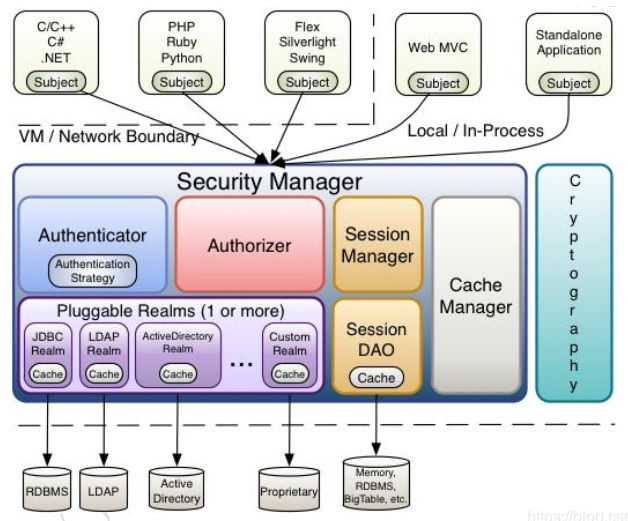

# shiro
## 1. shiro的架构
### 1.1. shiro的工作流程
> shiro的运行流程中，有3个核心的组件：**Subject, Security Manager 和 Realms**  

  

- `Subject`

> “当前操作用发户”。但是，在Shiro中，Subject这一概念并不仅仅指人，也可以是第三方进程、后台帐户（Daemon Account）或其他类似事物。  
> 它仅仅意味着“当前跟软件交互的东西”。但考虑到大多数目的和用途，你可以把它认为是Shiro的“用户”概念。  
> Subject代表了当前用户的安全操作，SecurityManager则管理所有用户的安全操作。

- `Security Manager`

> 它是Shiro框架的核心，典型的Facade模式，Shiro通过Security Manager来管理内部组件实例，并通过它来提供安全管理的各种服务。

- `Realm`

> `Realm`充当了`Shiro`与应用安全数据间的“桥梁”或者“连接器”。也就是说，当对用户执行认证（登录）和授权（访问控制）验证时，`Shiro`会从应用配置的`Realm`中查找用户及其权限信息。  
> 从这个意义上讲，`Realm`实质上是一个安全相关的==DAO==：它封装了数据源的连接细节，并在需要时将相关数据提供给`Shiro`。当配置Shiro时，你必须至少指定一个`Realm`，用于认证和（或）授权。配置多个`Realm`是可以的，但是至少需要一个。  
> `Shiro`内置了可以连接大量安全数据源（又名目录）的`Realm`，如`LDAP`、关系数据库（`JDBC`）、类似INI的文本配置资源以及属性文件等。如果缺省的`Realm`不能满足需求，你还可以插入代表自定义数据源的自己的`Realm`实现。  

     

### 1.2. RBAC模型
`Role Base Access Controll`：基于角色的访问控制  
shiro采用的安全管理模型，模型中有3个主体：用户，角色，权限：每个角色可以有多个权限，每一权限可以分配给多个角色；每个用户可以有多个角色，每一个角色可以分配给多个用户  
      

> **身份验证**：判断是否为合法用户  
> **权限校验**：用户要做的某一件事或使用的某些资源，必须要拥有某些角色，或必须拥有某些权限  

例子流程： 
>
> 1. 首先照旧记录用户的信息  
>
> 2. 然后定制角色  
> 如：“千峰学员”，“千峰讲师”
>
> 3. 然后对“资源”指定权限：即能对资源做的所有操作  
> 如“教室”资源：“进入教室”，“在教室学习”，就是对该资源的2个权限  
>
> 4. 然后将权限分配给不同的角色
> 如：“进入教室”分配给“千峰学员”，“千峰讲师” 2种角色，“在教室学习”分配给“千峰学员”角色  
>
> 5. 最后将角色分配给具体的用户  
> 如“张三”分配给“千峰学员”角色，“李四”分配给“千峰讲师”角色  
>

## 2. shiro使用
加入依赖：
```
<dependency>
    <groupId>org.apache.shiro</groupId>
    <artifactId>shiro-spring</artifactId>
    <version>1.4.0</version>
</dependency>
```
### shiro的配置方式

#### 方式一：使用shiro.ini配置文件来配置角色，权限
为了使得我们编写的ini文件有高亮的效果，我们可以给idea安装识别ini文件的插件：  
      
在resources目录下编写`shiro.ini`文件：

```
# 定义用户的信息
# 格式：用户名=密码,角色1,角色2,....
[users]
zhangsan=123,admin
lisi=456,manager,seller
wangwu=789,clerk

#--------------------------------------
# 角色及其权限信息
# 预定的权限：
#    user:query
#    user:detail:query
#    user:update
#    user:delete
#    user:insert
#    order:update
#    ........
[roles]
admin=*
# admin 拥有所有的权限，用*表示
clerk=user:query,user:detail:query
# clerk只有查询的功能
manager=user:*
# manager有user的所有权限
```
##### 权限的规则编写
> 最常用的权限标识：【资源：操作】
>
> - user:query,user:insert,order:insert  
>  【:】作为分隔符，分隔资源和操作  
>  【,】作为分隔符，分隔多个权限
> - user: * ,  * :query  
>  【*】作为通配符，【如果就只有一个 * 】代表一切权利    
>

##### 资源的授权访问(拦截器配置)
```
/login = anon
/unauthorized = anon
/static/** = anon
/authenticated = authc
/role = authc,roles[admin]
/permission = authc,perms["user:create"]

anon: 表示匿名访问，即不需要登录就可以访问，例如/login这个路径可以匿名访问

authe: 表示需要登录才能访问

roles[admin]: 表示有admin这个角色的用户才能访问

perms["user:create"]: 表示有这个权限的才能访问
```

### subject的各种操作
编写完配置文件，然后我们就可以测试了，在编写测试之前，我们必须要知道我们用户主要操作的是当前的Subject对象，而不用去管底层的`SecurityManager`内部的逻辑，要想实现这样的效果：
```
//加载配置文件，获取一个工厂
Factory<SecurityManager> factory = new IniSecurityManagerFactory("classpath:shiro.ini");
//从工厂中获得shiro的核心：SecurityManager
SecurityManager securityManager = factory.getInstance();
//将securityManager,shiro的核心类托管到SecurityUtils的工具类中，之后就不必要去关心SecurityManager
SecurityUtils.setSecurityManager(securityManager);
//获取一个subject，然后用户就可以直接面对subject，而不用去管SecurityManager的实现
Subject subject = SecurityUtils.getSubject();
```
获取到这个Subject当前用户之后，我们就可以直接来操作这个Subject,首先先总体看看subject中的所有可以操作的方法，几乎一切SecurityManager管理的对象，除了加密是需要自己额外编写:   
    
==【注意】== 有Subject和SecurityManager，但Realm呢？实际上  
    
    

#### 身份验证-登录
> - `subject.isAuthenticated()`  
>

`subject`的`isAuthenticated()`判断当前用户是否登录(从session中获取)  
> - `subject.login(Token)`  
> - `subject.logout()`

`login(Token)`登录操作，需要传入一个Token，我们可以使用用户名和密码的Token:
```
UsernamePasswordToken usernamePasswordToken = new UsernamePasswordToken("zhangsan", "123");
subject.login(usernamePasswordToken);
```
> `subject.getPrincipal()`
>

获取当前用户登录的用户名，如果没有登录过，则返回null
#### 角色校验
> `subject.hasRole(角色名)`
>

判断当前用户是否有角色，如果有则返回true，没有则返回false  
#### 权限校验
> `subject.isPermitted(权限的名称)`
>
```
System.out.println(subject.isPermitted("user:insert"));
```
### shiro与Web的集成

### shiro的标签
在pom文件引入依赖  
```
<dependency>
<groupId>com.github.theborakompanioni</groupId>
<artifactId>thymeleaf-extras-shiro</artifactId>
<version>2.0.0</version>
</dependency>
```
> shiro的配置类`ShiroConfig.java`添加bean【`at.pollux.thymeleaf.shiro.dialect.ShiroDialect`】
>

> 然后在页面中导入标签库
>

```
<html lang="en" xmlns:th="http://www.thymeleaf.org"
	  xmlns:shiro="http://www.pollix.at/thymeleaf/shiro">
```
#### 身份验证
    
#### 角色验证
    
#### 权限验证
    

### 自定义Realm  
> 下面是我们在与数据库结合开发的时候的步骤：


#### 1. 建表
```
create table t_user(
  id int primary key auto_increment,
  username varchar(20) not null unique ,
  password varchar(100) not null
)engine = innodb default charset =utf8;
insert into t_user(username, password) values ("吴慧华",123),("邓苏敏",456);


create table t_role(
  id int primary key auto_increment,
  role_name varchar(50) not null  unique ,
  create_time timestamp not null
)engine = innodb default charset =utf8;
insert into t_role(role_name, create_time) VALUES ("banzhang","2020-01-01"),("student","2020-01-02");

create table t_permission(
  id int primary key auto_increment,
  permission_name varchar(50) not null unique ,
  create_time timestamp
)engine = innodb default charset =utf8;
insert into t_permission(permission_name, create_time) VALUES ("student:yq","2020-01-02"),("student:study","2020-01-02");


create table t_user_role(
  id int primary key auto_increment,
  user_id int references t_user(id),
  role_id int references t_role(id),
  unique (user_id,role_id)
)engine = innodb default charset =utf8;
insert into t_user_role(user_id, role_id) VALUES (1,1),(1,2),(2,2);


create table t_role_permission(
  id int primary key auto_increment,
  permission_id int references t_permission(id),
  role_id int references t_role(id),
  unique (permission_id,role_id)
)engine = innodb default charset =utf8;
insert into t_role_permission(permission_id, role_id) VALUES (1,1),(2,1),(2,2);
```
> 表的说明: 至少5张表：用户表，角色表，权限表，角色_权限表(哪些角色有哪些权限，多对多)，用户_角色表  
> 用户有：吴慧华，邓苏敏  
> 角色有：班长，学生  
> 权限有：要钱(yq)，听课  
> 分配：吴慧华是班长角色，然后班长有要钱和听课权限,邓苏敏是学生角色，只有听课的权限   

#### 2. 编写我们自己的Realm
> 我们通过查看源码，我们可以发现，所有的Ream都是来源于超级父类`Realm`  

    